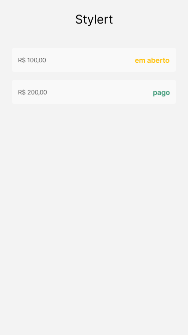
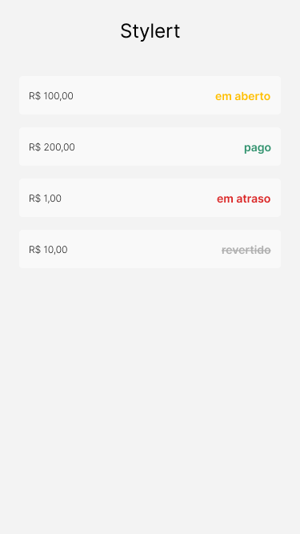

# criando-componentes-com-styled-components-react-native

## Motivação

Reaproveitamento de código, organização centralizada, manutenção.

## Desafio



## Construção do código

Criação do Container

```jsx
// src/components/Card/styles.tsx

import styled from "styled-components/native";

export const Container = styled.View`
  height: 72px;
  padding: 14px;
  margin: 24px;
  border-radius: 4px;
  background-color: ${({ theme }) => theme.colors["neutral-100"]};
  flex-direction: row;
  justify-content: space-between;
  align-items: center;
`;
```

Utilizando o Container

```jsx
// src/components/Card/index.tsx

import { Container } from "./styles";

<Container>
  <Text>Hello</Text>
  <Text>Hello</Text>
</Container>;
```

<hr/>

### Ganhos

- [x] estilos centralizados;
- [x] escopos locais, ou seja, sem efeitos colaterais dado que a alteração ocorre somente naquele ambiente;
- [x] e algo muito massa, são estilos dinâmicos;

<hr/>

Criação da label e da descrição

```jsx
// src/components/Card/styles.tsx

export const Label = styled.Text`
  font-family: ${({ theme }) => theme.fonts.text};
  font-size: 24px;
  color: ${({ theme }) => theme.colors["neutral-700"]};
`;

export const Description = styled.Text`
  font-family: ${({ theme }) => theme.fonts.text};
  font-size: 24px;
  color: ${({ theme }) => theme.colors["neutral-700"]};
`;
```

```jsx
// src/components/Card/index.tsx

import { Container, Label, Description } from "./styles";

<Container>
  <Label>R$ 100,00</Label>
  <Description>pago</Description>
</Container>;
```

Criando um estilo compartilhado

```jsx
// src/components/Card/styles.tsx

import styled, { css } from "styled-components/native";

const fontVariant = css`
  font-family: ${({ theme }) => theme.fonts.text};
  font-size: 24px;
  color: ${({ theme }) => theme.colors["neutral-700"]};
`;

export const Label = styled.Text`
  ${fontVariant};
`;

export const Description = styled.Text`
  ${fontVariant};
`;
```

### Criando interface

```ts
// src/components/Card/interface.ts

export interface ICardProps {
  amount: string;
  status: "em aberto" | "pago";
}
```

### Recebendo as props

```jsx
// src/components/Card/index.tsx

import React from "react";
import { ICardProps } from "./interface";

import { Container, Label, Description } from "./styles";

const Card = ({ amount, status }: ICardProps) => {
  return (
    <Container>
      <Label>{amount}</Label>
      <Description>{status}</Description>
    </Container>
  );
};

export default Card;
```

### Adicionando os valores no App

```jsx
// src/components/App.tsx

<Card amount="R$ 100,00" status="pago" />
```

### Melhorando a interface

```ts
// src/components/Card/interface.ts

export enum CardStatus {
  PAGO = "pago",
  EM_ABERTO = "em aberto",
}

export interface ICardProps {
  amount: string;
  status: keyof typeof CardStatus;
}
```

```jsx
// src/components/Card/index.tsx
import { ICardProps, CardStatus } from "./interface";

<Description>{CardStatus[status]}</Description>;
```

```jsx
// src/App.tsx

<Card amount="R$ 100,00" status="PAGO" />
```

<hr/>

### Adicionando estilo a label e descrição

```jsx
// src/components/Card/index.tsx

const Card = ({ amount, status }: ICardProps) => {
  const isPaid = status === "PAGO" ? "success-400" : "warning-400";

  return (
    <Container>
      <Label>{amount}</Label>
      <Description color={isPaid}>{CardStatus[status]}</Description>
    </Container>
  );
};
```

```jsx
// src/components/Card/interface.ts
import { colors } from "../../theme/colors";

export interface ICardStyledProps {
 color: keyof typeof colors;
}
```

```jsx
// src/components/Card/styles.tsx

export const Description =
  styled.Text <
  ICardStyledProps >
  `
 ${fontVariant};
 color: ${({ color, theme }) => theme.colors[color]};
`;
```

```jsx
// src/App.tsx

<Card amount="R$ 100,00" status="PAGO" />
<Card amount="R$ 100,00" status="EM_ABERTO" />
```

### Solicitando alterações



```jsx
// src/components/Card/index.tsx

import { ICardProps, CardStatus, TCardStatusVariant } from "./interface";

const Card = ({ amount, status }: ICardProps) => {
  // const isPaid = status === "PAGO" ? "success-400" : "warning-400";

  const statusVariant: TCardStatusVariant = {
    PAGO: "success-400",
    EM_ABERTO: "warning-400",
    EM_ATRASO: "error-400",
    REVERTIDO: "neutral-400",
  };

  return (
    <Container>
      <Label>{amount}</Label>
      <Description color={statusVariant[status]}>
        {CardStatus[status]}
      </Description>
    </Container>
  );
};
```

Adicionar os itens a interface

```ts
// src/components/Card/interface.ts
export enum CardStatus {
  PAGO = "pago",
  EM_ABERTO = "em aberto",
  EM_ATRASO = "em atraso",
  REVERTIDO = "revertido",
}

export type TCardStatusVariant = {
  [key in keyof typeof CardStatus]: keyof typeof colors;
};
```

### Adicionando cor dinâmica

```jsx
// src/components/Card/index.tsx

import { ICardProps, CardStatus, TCardStatusVariant } from "./interface";

const Card = ({ amount, status }: ICardProps) => {
  // const isPaid = status === "PAGO" ? "success-400" : "warning-400";

  const isStatusReversed = status === "REVERTIDO";

  const statusVariant: TCardStatusVariant = {
    PAGO: "success-400",
    EM_ABERTO: "warning-400",
    EM_ATRASO: "error-400",
    REVERTIDO: "neutral-400",
  };

  return (
    <Container>
      <Label>{amount}</Label>
      <Description
        strikeThrough={isStatusReversed}
        color={statusVariant[status]}
      >
        {CardStatus[status]}
      </Description>
    </Container>
  );
};
```

Adicionando a interface

```ts
// src/components/Card/interface.ts

export interface ICardStyledProps {
  color: keyof typeof colors;
  strikeThrough: boolean;
}
```

```jsx
// src/components/Card/styles.tsx

${({ strikeThrough, theme, color }) =>
   strikeThrough &&
   css`
     text-decoration: line-through;
     text-decoration-color: ${theme.colors[color]};
   `};

```